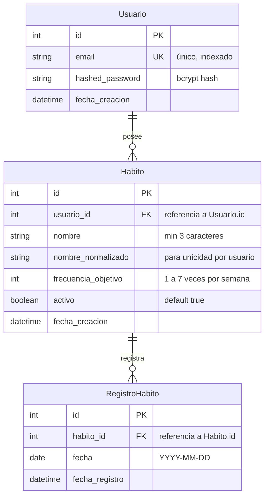

# Data Model: Seguimiento de Hábitos

**Feature**: `specs/001-seguimiento-habitos`
**Date**: 2026-09-23
**Status**: Completed

---

## 1. Diagrama Entidad-Relación



---

## 2. Definición de Entidades y Restricciones

### 2.1 Entidad `Usuario` (`usuarios`)

- **Campos**:
  - `id`: `Integer`, Primary Key, autoincremental.
  - `email`: `String(255)`, Unique, Not Null, indexado.
  - `hashed_password`: `String(255)`, Not Null (nunca se expone en respuestas ni logs).
  - `fecha_creacion`: `DateTime`, Default `datetime.utcnow`.
- **Restricciones de Negocio**:
  - Email válido según RFC standard vía `EmailStr`.
  - No duplicidad de emails a nivel persistencia (`UniqueConstraint('email')`).

---

### 2.2 Entidad `Habito` (`habitos`)

- **Campos**:
  - `id`: `Integer`, Primary Key, autoincremental.
  - `usuario_id`: `Integer`, Foreign Key (`usuarios.id`), Not Null, indexado.
  - `nombre`: `String(100)`, Not Null (formato visual tal como ingresó el usuario con espacios limpios).
  - `nombre_normalizado`: `String(100)`, Not Null (minúsculas y espacios colapsados).
  - `frecuencia_objetivo`: `Integer`, Not Null.
  - `activo`: `Boolean`, Default `True`, Not Null.
  - `fecha_creacion`: `DateTime`, Default `datetime.utcnow`.
- **Restricciones y Reglas**:
  - **R1**: `len(nombre.strip()) >= 3`.
  - **R2**: `1 <= frecuencia_objetivo <= 7`.
  - **R3**: Unicidad por `(usuario_id, nombre_normalizado)`.
  - **Restricción BD**: `UniqueConstraint('usuario_id', 'nombre_normalizado', name='uq_usuario_habito_nombre')`.

---

### 2.3 Entidad `RegistroHabito` (`registros_habitos`)

- **Campos**:
  - `id`: `Integer`, Primary Key, autoincremental.
  - `habito_id`: `Integer`, Foreign Key (`habitos.id`), Not Null, indexado.
  - `fecha`: `Date`, Not Null (fecha del cumplimiento).
  - `fecha_registro`: `DateTime`, Default `datetime.utcnow`.
- **Restricciones y Reglas**:
  - **R4**: No duplicidad del mismo hábito en el mismo día.
  - **R5**: `fecha <= date.today()`.
  - **Restricción BD**: `UniqueConstraint('habito_id', 'fecha', name='uq_habito_fecha_registro')`.

---

## 3. Contrato de Retorno de Repositorios (Artículo I.3)

Todos los repositorios retornan diccionarios planos (`dict`), por ejemplo:

```python
def _habito_a_dict(habito: Habito) -> dict:
    return {
        "id": habito.id,
        "usuario_id": habito.usuario_id,
        "nombre": habito.nombre,
        "frecuencia_objetivo": habito.frecuencia_objetivo,
        "activo": habito.activo,
        "fecha_creacion": habito.fecha_creacion.isoformat() if habito.fecha_creacion else None,
    }
```
